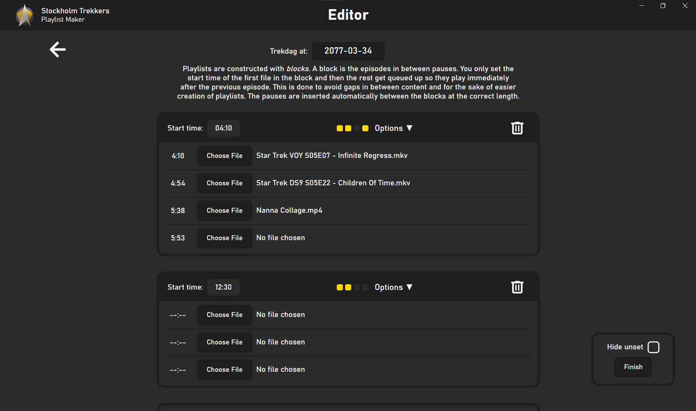
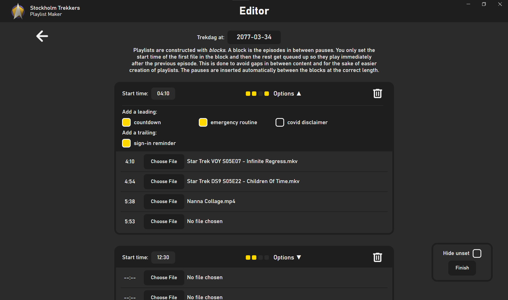
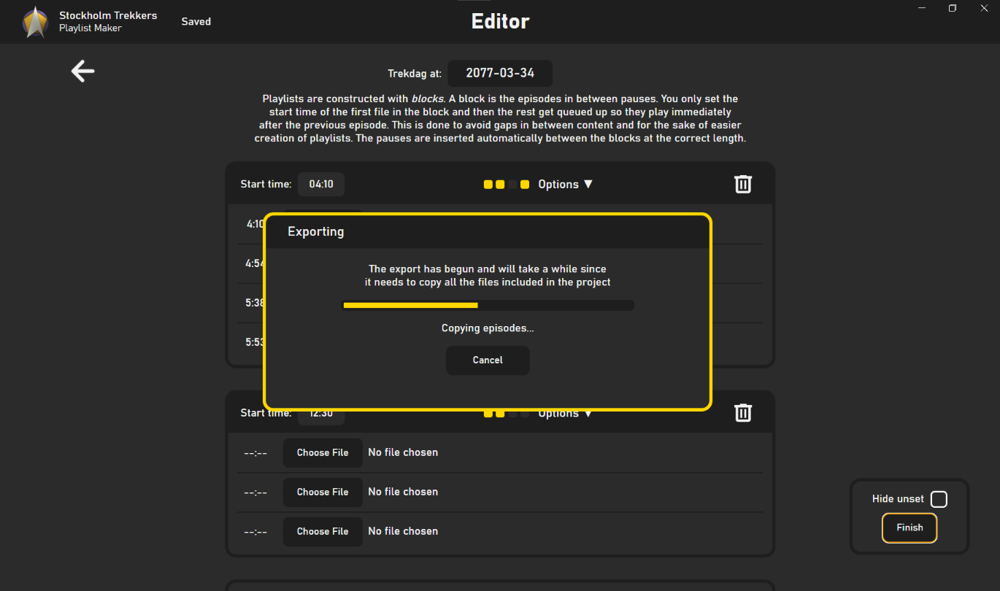

# Playlist Maker for Stockholm Trekkers
[Stockholm Trekkers](https://www.stockholmtrekkers.se/stockholm-trekkers-english/) is an nonprofit organization that brings Star Trek enjoyers together.

This desktop app is a tool we use to create playlists for our Star Trek viewing get-togethers.

### Images

    
    

    
    

### Purpose
The organization regularly organizes events where we watch Star Trek episodes and movies together. To watch these episodes that we choose in advance, we need to have a playlist ready. This program helps us create that playlist.

### Installation
Navigate to the [releases](https://github.com/viggoStrom/Stockholm-Trekkers-Playlist-Maker/releases) page on GitHub and choose the latest version and open the `Assets` dropdown. Download the installer file (.msi for windows) and run it. For the time being, the package is unsigned so therefore you will get a warning when you run the installer. You can ignore this warning and proceed with the installation. The program is safe and open source so if you don't trust me, you can have a look at the code.

### How to use it
Once you get into the app the experience should be rather intuitive. On an overarching level, you pick the episodes you want to watch, set the start time for different parts of the playlist and export the playlist to a folder. The app will guide you through the process. If you have any questions, feel free to ask me. The goal of this app is for it to be easy to use and I am always looking for ways to improve it.

### Technologies
The app is made with [Electron](https://www.electronjs.org/) which is a framework for building cross-platform desktop applications with web technologies. Therefore, the app is written in JavaScript, HTML, and CSS.

On export, the app creates a `.ps1` script (powershell) that acts as a *harness* for [VLC](https://www.videolan.org/vlc/). The script decides when to start the next episode, when to start the countdown, and much more. We use the powershell solution for consistency and reliability. VLC has a built in playlist system but it lacks the flexibility that we need.

### How to build
Prerequisites:
[Node.js](https://nodejs.org/en/),
[NPM](https://www.npmjs.com/),
[Git](https://git-scm.com/),
[Yarn](https://yarnpkg.com/)

#### Windows & Linux
The steps are the same for Windows and Linux.

#### Steps:
* Clone the repository
  * You may want to checkout to a specific tag e.g. `git checkout v2.1.0`
* Run `yarn install`
* Run `yarn build`
* The build will end up in the `dist` folder

You may get a warning about unmet dependencies or "asar" but you can ignore those.
