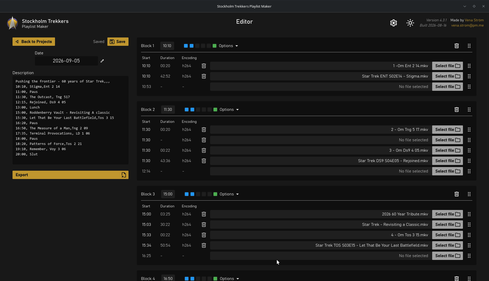
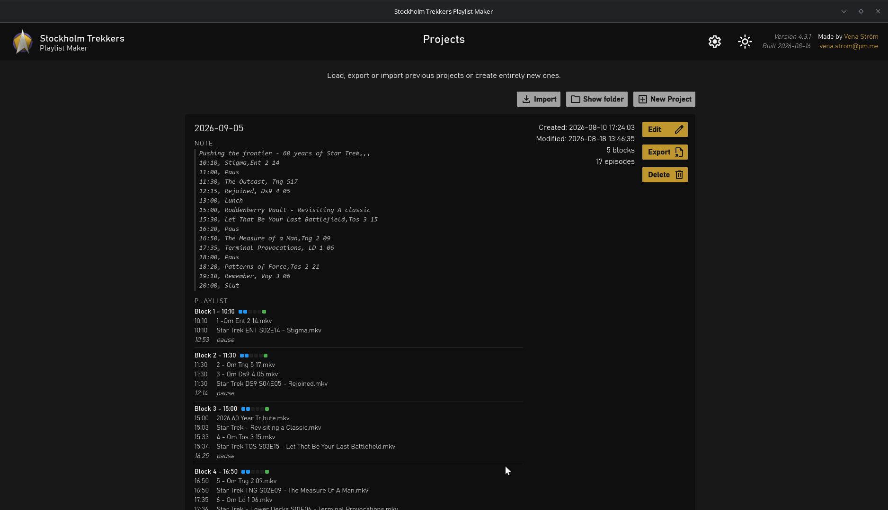
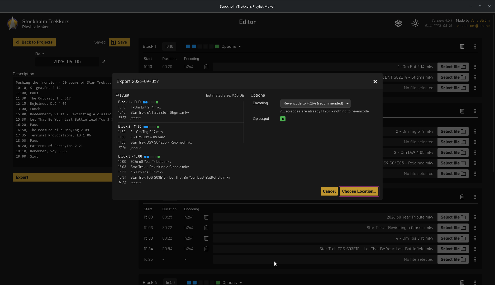

# Playlist Maker for Stockholm Trekkers
[Stockholm Trekkers](https://www.stockholmtrekkers.se/stockholm-trekkers-english/) is a nonprofit organization that brings Star Trek enjoyers together.

This desktop app is a tool we use to create playlists for our Star Trek viewing get-togethers.

  
More images

  
  

### Purpose
The organization regularly organizes events where we watch Star Trek episodes and movies together. To watch these episodes that we choose in advance, we need to have a playlist ready. This program helps us create that playlist.

### Installation
Navigate to the [releases](https://github.com/VenaStrom/Stockholm-Trekkers-Playlist-Maker/releases) page on GitHub, choose the latest version, and open the `Assets` dropdown. Download the installer (`.exe` for Windows, `.deb` or `.AppImage` for Linux) and run it. For the time being, the program is unsigned so you may get a warning when you run the installer. You need to ignore this warning to proceed with the installation. The program is safe and open source. If you don't trust me, you can have a look at the code.

Once installed, the app checks for new versions on launch and can update itself in place, so you only need to download from GitHub once.

### How to use it
Once you get into the app the experience should be rather intuitive. On an overarching level, you create a project in which you add the video files you want to play. You set the start times for the different parts of the playlist and then you export the playlist to a folder. The app will guide you through the process. If you have any questions, feel free to ask me, Vena. The goal of this app is for it to be easy to use and I am always looking for ways to improve it.

### Uninstalling
You uninstall it like any other program on your computer. On Windows that is through the settings app in the `Apps & Features` tab. Your project save files are kept by default. They are located in the app data folder:
- Windows: `C:\Users\<username>\AppData\Roaming\com.stockholm-trekkers.playlist-maker`
- Linux: `~/.local/share/com.stockholm-trekkers.playlist-maker`

### Technologies
The app is made with [Tauri](https://tauri.app/), a framework for building cross-platform desktop applications with a Rust backend and a web frontend. The frontend is written in TypeScript with [React](https://react.dev/) and [Tailwind CSS](https://tailwindcss.com/), built with [Vite](https://vite.dev/). A bundled [ffmpeg](https://ffmpeg.org/) sidecar probes episode files and can re-encode them on export.

On export, the app creates `play.ps1` (PowerShell) and `play.sh` (bash) scripts that act as a *harness* for [VLC](https://www.videolan.org/vlc/). The script decides when to start the next episode, when to start the countdown, and much more. We use the script solution for consistency and reliability. VLC has a built-in playlist system but it lacks the flexibility that we need.

The app also doubles as a headless CLI for scripting and AI assistants — see [docs/cli.md](docs/cli.md).

### How to build

#### On GitHub - Preferred
This repository has a workflow that builds the app for you.

Navigate to the [Actions tab](https://github.com/VenaStrom/Stockholm-Trekkers-Playlist-Maker/actions) for this repository. Open the `Build` workflow, click the `Run workflow` button, and confirm in the popup that appears. Once the run finishes with a green checkmark, the installers for Windows and Linux can be downloaded as zip files from the `Artifacts` section on that run's page.

Publishing a release (including the update manifest for in-app updates) is done the same way with the `Release` workflow.

#### Locally
Prerequisites:
- [Node.js](https://nodejs.org/en/) (v24)
- [Yarn](https://yarnpkg.com/) 4 (`corepack enable`)
- [Rust](https://www.rust-lang.org/tools/install)
- On Linux: the [Tauri system dependencies](https://tauri.app/start/prerequisites/#linux) (webkit2gtk et al.)

Steps:
1. Clone the repository
   - You may want to checkout a specific tag e.g. `git checkout v4.3.1`
2. Run `yarn install`
3. Run `yarn build`
4. The installers end up in `src-tauri/target/release/bundle/`

The build downloads the shared video assets (pause clips, countdowns, ...) and an ffmpeg binary for your platform on first run. For development, `yarn dev` starts the app with hot reload.

## Documentation
- [Headless CLI](docs/cli.md)
