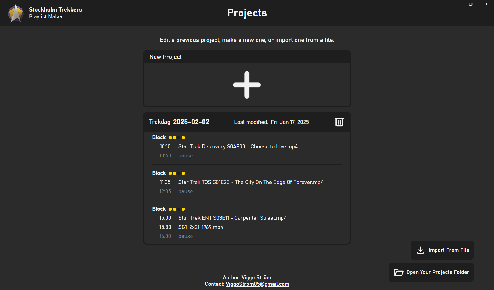

# Playlist Maker for Stockholm Trekkers
[Stockholm Trekkers](https://www.stockholmtrekkers.se/stockholm-trekkers-english/) is an nonprofit organization that brings Star Trek enjoyers together.

This desktop app is a tool we use to create playlists for our Star Trek viewing get-togethers.

  
More images

  
  
  
  
  
  
  

### Purpose
The organization regularly organizes events where we watch Star Trek episodes and movies together. To watch these episodes that we choose in advance, we need to have a playlist ready. This program helps us create that playlist.

### Installation
Navigate to the [releases](https://github.com/VenaStrom/Stockholm-Trekkers-Playlist-Maker/releases) page on GitHub and choose the latest version and open the `Assets` dropdown. Download the installer file (`.exe` for Windows. `.deb` for Linux) and run it. For the time being, the program is unsigned so you may get a warning when you run the installer. You need to ignore this warning to proceed with the installation. The program is safe and open source. If you don't trust me, you can have a look at the code.

### How to use it
Once you get into the app the experience should be rather intuitive. On an overarching level, you pick create a project in which you add the video files you want to play. You set the start times for the different parts of the playlist and then you export the playlist to a folder. The app will guide you through the process. If you have any questions, feel free to ask me, Vena. The goal of this app is for it to be easy to use and I am always looking for ways to improve it.

### Uninstalling
You uninstall it like any other program on your computer. On Windows that is through the settings app in the `Apps & Features` tab. You will be asked if you want to keep your project save files. They should be located in (on Windows) `C:\Users\<username>\stockholm-trekkers-playlist-maker`.

### Technologies
The app is made with [Electron](https://www.electronjs.org/) which is a framework for building cross-platform desktop applications with web technologies. Therefore, the app is written in JavaScript, HTML, and CSS.

On export, the app creates a `.ps1` script (powershell) that acts as a *harness* for [VLC](https://www.videolan.org/vlc/). The script decides when to start the next episode, when to start the countdown, and much more. We use the powershell solution for consistency and reliability. VLC has a built in playlist system but it lacks the flexibility that we need.

### How to build

#### On GitHub - Preferred
GitHub has features that allow you to set up workflows to automate anything. This repository has a workflow that builds the app for you. 

Navigate to the [GitHub Actions page](https://github.com/VenaStrom/Stockholm-Trekkers-Playlist-Maker/actions/workflows/building.yml) for this repository. Click on the `Build Electron App` workflow and look for the `Run workflow` button and in the popup that appears, click the green `Run workflow` button. The workflow will start and you can follow the progress in the `Actions` tab. Once it's done, it will show a green checkmark and on the page of that specific workflow run, you can download the installers as zip files. They are located in the `Artifacts` section.

#### Locally
Prerequisites:
[Node.js](https://nodejs.org/en/),
[NPM](https://www.npmjs.com/),
[Git](https://git-scm.com/),
[Yarn](https://yarnpkg.com/)

##### Windows & Linux
The steps are the same for Windows and Linux. I have used [WSL](https://learn.microsoft.com/en-us/windows/wsl/install) to build the linux.

##### Steps:
1. Clone the repository
  * You may want to checkout to a specific tag e.g. `git checkout v2.1.0`
2. Run `yarn build`
3. The build will end up in the `dist` folder

You may get a warning about unmet dependencies or "asar" but you can ignore those. If you wish to know more about the asar warning, see the [documentation](docs/notes-on-asar.md).

## Documentation
- [Adding a New Leading or Trailing Clip](docs/add-leading-or-trailing-clip.md)
- [Adding a New File Asset to be Downloaded](docs/adding-a-file-download.md)
- [Renderer Styling](docs/renderer-styling.md)
- [Changing File Paths](docs/changing-file-paths.md)
- [Information About Exporting](docs/information-about-exporting.md)
- [Notes on ASAR](docs/notes-on-asar.md)
