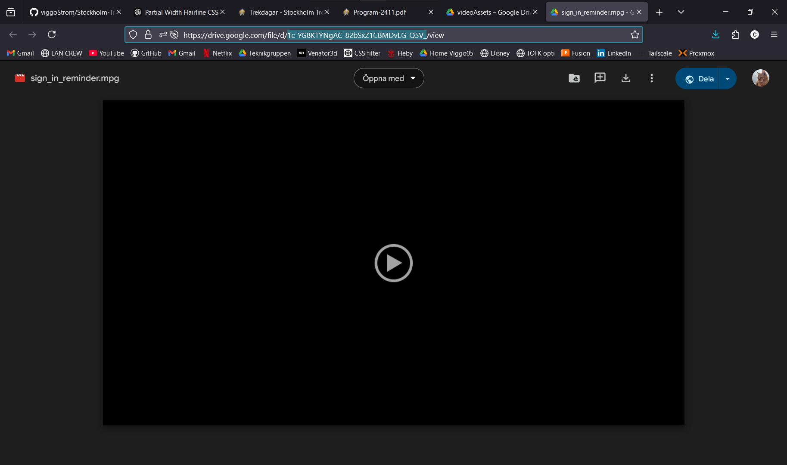

# Adding a asset to download

## How assets are downloaded
The [downloadAssets.js](./downloadAssets.js) file loops through the [fileURLs.json](./fileURLs.json) file and goes to `<urlTemplate>+<videos.id>` to download the file.

## How to add a new asset to download
The program uses google drive to store the assets. To add a new asset to download, you need to get the file id of the asset and add it to the [fileURLs.json](./fileURLs.json) file.

### Steps
1. You need to have the asset uploaded to google drive.
2. Get the file id of the asset.
   - To do this the easiest way is to go to the asset in google drive and open it in a new tab. You should be brought to a page that looks like this:

In the url bar you will see a long string of characters that looks like this: `1POheLkrK_1O786JByNvmHBnxbEijn82E`, keep in mind that it can contain underscores, dashes, and other characters. Copy this string.

3. Open the [fileURLs.json](./fileURLs.json) file and add a new object to the `videos` array. The file should look something like this:
```json
{
    "urlTemplate": "https://drive.google.com/uc?export=download&id=",
    "videos": [
        // There might be other objects here
        {"name": "your-new-clip.mpeg", "id": "1c-YG8KTYNgAC-82bSxZ1CBMDvEG-Q5V_"}
    ]
}
```
Add the string you copied from the url to the `id` field and the name of the file to the `name` field. You can set the name to whatever you want as long as the file extension is correct.